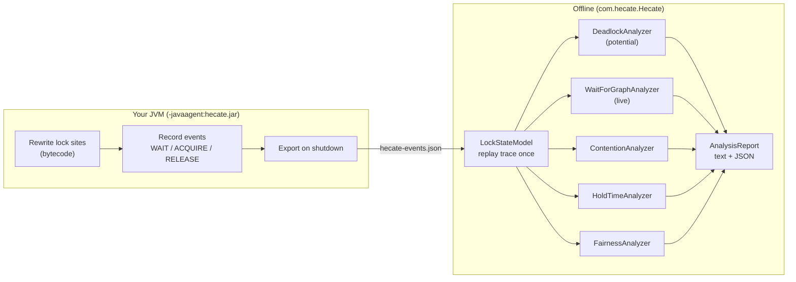

<div align="left">

# Hecate

**Catch JVM concurrency bugs, including deadlocks that never actually happened.**

Hecate attaches to any Java program, records every lock acquire and release as it runs,
then analyzes the trace offline to surface deadlocks (both predicted and live), lock
contention, long critical sections, and thread starvation.

[](https://github.com/aryankhare2110/hecate/actions/workflows/ci.yml)


</div>

---

## Why Hecate?

Concurrency bugs are timing-dependent. A deadlock might lurk in your code for months and
only strike in production under the wrong interleaving. Testing the one execution that
*didn't* hang tells you nothing.

Hecate's deadlock analysis is **predictive**. From a *single, successful* run it
reconstructs how your threads order their locks and proves whether a different schedule
*could* deadlock. That's the difference between *"it didn't crash this time"* and
*"this code has a latent deadlock, and here's the exact cycle."*

```
  [1]  CRITICAL  DEADLOCK
       Potential deadlock: a circular lock order across 2 threads could deadlock under a different schedule.
         - Thread-1 holds lock@226f0381, wants lock@26aa642e
         - Thread-2 holds lock@26aa642e, wants lock@226f0381
```

And when a program *does* hang, Hecate detects the live deadlock from the interrupted trace
(see below). It works on plain `synchronized` (blocks **and** methods, including inside
lambdas) and on `java.util.concurrent.locks` (`ReentrantLock`, `ReentrantReadWriteLock`, and
friends).

---

## Quick start

Hecate is a single self-contained jar. It's both the **agent** (captures traces) and the
**analyzer** (reads them). No configuration, no code changes to your program.

### Option A: download and run (no build)

1. Grab `hecate.jar` from the [latest release](https://github.com/aryankhare2110/hecate/releases/latest).
2. Run your program with the agent attached, then analyze:

```bash
# 1. Capture: attach Hecate to any Java program
java -javaagent:hecate.jar -jar your-program.jar
# for a plain compiled class instead of a runnable jar, launch it with -cp (run any one)
java -javaagent:hecate.jar -cp . YourMainClass
# either way it writes hecate-output/hecate-events.json on exit

# 2. Analyze: print the report (run from the same folder)
java -cp hecate.jar com.hecate.Hecate
```

> `your-program.jar` is a placeholder: use `-jar` for a runnable jar, or `-cp <dir> <MainClass>`
> for loose `.class` files.

### Option B: build from source

```bash
git clone https://github.com/aryankhare2110/hecate.git
cd hecate
mvn clean package          # produces target/hecate.jar, also runs the test suite
```

> **Heads-up:** the trace is written by a JVM shutdown hook, so the target program must
> exit (or be interrupted). A clean exit, `SIGTERM`, or Ctrl-C all run the hook; only
> `kill -9` skips it. Long-running servers dump on shutdown.

---

## Demos

The repo ships runnable demos under
[`src/test/java/com/hecate/testapps`](src/test/java/com/hecate/testapps). Add
`--json report.json` to any analyze step to also emit a machine-readable report.

### Predicted deadlock (a run that completes)

`ReentrantLockDemo` takes two locks in opposite orders across two threads, a classic latent
deadlock, but runs them sequentially so it never actually hangs. Hecate predicts it anyway:

```bash
java -javaagent:target/hecate.jar \
     -cp "target/hecate.jar:target/test-classes" \
     com.hecate.testapps.ReentrantLockDemo
java -cp target/hecate.jar com.hecate.Hecate
```

```
================================================================
  Hecate Concurrency Analysis
================================================================
  Trace      14 events, 2 locks, 3 threads, 5 acquisitions
  Findings   5   (2 critical, 1 warning, 2 info)

  [1]  CRITICAL  DEADLOCK
       Potential deadlock: a circular lock order across 2 threads could deadlock under a different schedule.
         - Thread-1 holds lock@43d75c8e, wants lock@8b7777c
         - Thread-2 holds lock@8b7777c, wants lock@43d75c8e

  [2]  CRITICAL  FAIRNESS
       Lock lock@43d75c8e (java.util.concurrent.locks.ReentrantLock): uneven wait distribution (fairness index 0.43 across 3 threads; per-thread waits 0 ns to 339.5 µs).

  [3]  WARNING   FAIRNESS
       ...
  [4]  INFO      CONTENTION
       ...
================================================================
```

### Live deadlock (a program that actually hangs)

A genuinely deadlocked program never exits, so interrupt it (Ctrl-C) once it's stuck and the
shutdown hook still writes the trace. The bundled demos deliberately avoid hanging (so the
build never does); point Hecate at any program that truly deadlocks, for example:

```java
// Deadlock.java: two threads take A and B in opposite orders, and hang.
public class Deadlock {
    static final Object A = new Object(), B = new Object();
    public static void main(String[] a) {
        new Thread(() -> { synchronized (A) { pause(); synchronized (B) {} } }, "T1").start();
        new Thread(() -> { synchronized (B) { pause(); synchronized (A) {} } }, "T2").start();
    }
    static void pause() { try { Thread.sleep(50); } catch (Exception e) {} }
}
```

```bash
javac Deadlock.java
java -javaagent:hecate.jar -cp . Deadlock    # hangs; wait a moment, then press Ctrl-C
java -cp hecate.jar com.hecate.Hecate
```

```
  [1]  CRITICAL  DEADLOCK (LIVE)
       Live deadlock: 2 threads are blocked in a cycle, each waiting on a lock another holds.
         - T1 is blocked on lock@5b1d2887, held by T2
         - T2 is blocked on lock@7a3e0f11, held by T1
```

Other demos: `SynchronizedBlockTest`, `SynchronizedMethodTest`, `DeadlockDemo` (monitor
AB-BA), `OverheadBenchmark`.

---

## What it analyzes

| Analyzer | Flags | How |
|---|---|---|
| **Potential deadlock** | Latent circular lock orderings (AB-BA and longer) from a run that completed | iGoodLock |
| **Live deadlock** | Threads actually stuck in a cycle when the trace ended | wait-for graph |
| **Contention** | Locks that serialize the program | `Σ wait / Σ hold` per lock |
| **Hold-time** | Abnormally long critical sections (likely I/O under a lock) | hold > `mean + 2σ` |
| **Fairness** | Thread starvation | Jain's index over per-thread wait |

Findings are tagged `INFO` / `WARNING` / `CRITICAL` and rendered most-severe-first, with
durations shown in readable units.

---

## How it works

Capture and analysis are **fully decoupled**. The agent only writes a JSON trace; all the
reasoning happens offline. So analysis can't perturb or crash your program, traces are
replayable, and every analyzer is unit-tested against hand-written traces.



**Capture.** A `ClassFileTransformer` rewrites bytecode as classes load: `synchronized`
blocks (`MONITORENTER`/`MONITOREXIT`) and `Lock` calls (`lock`/`unlock`/`tryLock`) get a
tiny callback wrapped around them; `synchronized` methods are handled with ByteBuddy advice.
It reads classes compiled by any JDK (including current Java 25 bytecode), so a newer
compiler doesn't stop instrumentation. Each lock event (`WAIT` / `ACQUIRE` / `RELEASE`) is
queued and exported on shutdown.

**Analysis.** `LockStateModel` replays the timestamp-sorted events once, pairing
WAIT, ACQUIRE, RELEASE per thread (handling nesting and reentrancy) into immutable
acquisition records, and noting which threads were still blocked at the end. Five
independent analyzers read that shared model.

### Potential deadlocks (iGoodLock)

Every nested acquisition becomes a dependency `(thread, lock, locks-already-held)`. The
analyzer searches for a chain of dependencies that closes into a cycle: thread *i* holds
the lock thread *i+1* wants. Three filters remove the textbook false positives:

- **Reentrancy** : a lock can't depend on itself.
- **Distinct threads** : a single thread's lock order can't deadlock against itself.
- **Gate locks** : if a shared outer lock guards the whole cycle, it serializes the threads
  and the cycle is benign.

The cycle is reported even when the analyzed run completed cleanly.

### Live deadlocks (wait-for graph)

A genuinely deadlocked program never exits, so its trace is written only if you interrupt
it (Ctrl-C / `SIGTERM` still runs the shutdown hook). In that trace the stuck threads each
hold one lock and wait on another, which iGoodLock can't see (no nesting ever completes).
The wait-for-graph analyzer reads the end-of-trace state instead: it draws an edge from
each blocked thread to whoever holds the lock it wants, and any cycle is a live deadlock.

---

## Performance

Measured with `OverheadBenchmark` (4 threads hammering an **empty** `synchronized` block,
the worst case, where lock bookkeeping is 100% of the work):

| | work elapsed |
|---|---|
| baseline | ~18 ms |
| with agent | ~190 ms |

That's **~0.86 µs of overhead per lock acquisition** (three events recorded each). For real
critical sections doing actual work (microseconds to milliseconds), that's well under 1%.
The ~10x figure only appears in a degenerate tight loop locking around nothing.

---

## Building & testing

```bash
mvn clean package     # build the jar + run all tests
mvn test              # tests only
```

Requires JDK 11+ to build. The agent runs on any JVM and instruments programs compiled by
any JDK. CI builds and tests on Java 11, 17, and 21.

---

## Limitations & roadmap

- **Lock identity** uses `System.identityHashCode`, which can collide and be reused after
  GC. Identity is pluggable (`LockKeyFn`); a stabler allocation-site key is the next upgrade.
- Only the no-arg `tryLock()` is instrumented (not the timed `tryLock(long, TimeUnit)`).
- A live deadlock is only captured if the hung program is interrupted so its shutdown hook
  runs (`SIGTERM`/Ctrl-C); a `kill -9` leaves no trace.
- Analysis is offline; there is no live/streaming mode yet.

---

## License

Released under the [MIT License](LICENSE).
