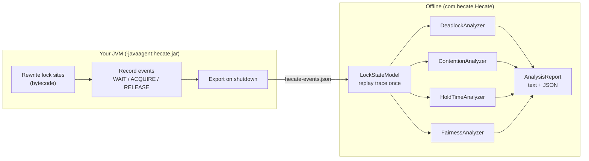

<div align="left">

# Hecate

**Catch JVM concurrency bugs, including deadlocks that never actually happened.**

Hecate attaches to any Java program, records every lock acquire and release as it runs,
then analyzes the trace offline to surface deadlocks, lock contention, long critical
sections, and thread starvation.

[](https://github.com/aryankhare2110/hecate/actions/workflows/ci.yml)


</div>

---

## Why Hecate?

Concurrency bugs are timing-dependent, a deadlock might lurk in your code for months and
only strike in production under the wrong interleaving. Testing the one execution that
*didn't* hang tells you nothing.

Hecate's deadlock analysis is **predictive**. From a *single, successful* run it
reconstructs how your threads order their locks and proves whether a different schedule
*could* deadlock. That's the difference between *"it didn't crash this time"* and
*"this code has a latent deadlock and here's the exact cycle."*

```
[CRITICAL] DEADLOCK  Potential deadlock — circular lock order:
  Thread-1 holds lock@226f0381 wants lock@26aa642e;
  Thread-2 holds lock@26aa642e wants lock@226f0381
```

It works on plain `synchronized` (blocks **and** methods, including inside lambdas) and on
`java.util.concurrent.locks` (`ReentrantLock`, `ReentrantReadWriteLock`, …).

---

## Quick start

Hecate is a single self-contained jar, it's both the **agent** (captures traces) and the
**analyzer** (reads them). No configuration, no code changes to your program.

### Option A: download and run (no build)

1. Grab `hecate.jar` from the [latest release](https://github.com/aryankhare2110/hecate/releases/latest).
2. Run your program with the agent attached, then analyze:

```bash
# 1. Capture: attach Hecate to any Java program
java -javaagent:hecate.jar -jar your-program.jar
#    → writes hecate-output/hecate-events.json on exit

# 2. Analyze: print the report
java -cp hecate.jar com.hecate.Hecate
```

### Option B: build from source

```bash
git clone https://github.com/aryankhare2110/hecate.git
cd hecate
mvn clean package          # → target/hecate.jar  (also runs the test suite)
```

> **Heads-up:** the trace is written by a JVM shutdown hook, so the target program must
> exit normally (a `kill -9` skips it; `SIGTERM`/Ctrl-C is fine). Long-running servers dump
> on shutdown.

---

## Try it in 30 seconds

The repo ships runnable demos. This one takes two locks in opposite orders across two
threads, a classic latent deadlock, but runs them sequentially so it never actually hangs:

```bash
java -javaagent:target/hecate.jar \
     -cp "target/hecate.jar:target/test-classes" \
     com.hecate.testapps.ReentrantLockDemo

java -cp target/hecate.jar com.hecate.Hecate
```

```
========== Hecate Analysis Report ==========
Events: 14   Locks: 2   Threads: 3   Acquisitions: 5
Findings: 4  (CRITICAL 2, WARNING 0, INFO 2)
--------------------------------------------
[CRITICAL] DEADLOCK   Potential deadlock — circular lock order: Thread-1 holds … wants …; Thread-2 holds … wants …
[CRITICAL] FAIRNESS   Lock … (ReentrantLock) — fairness index 0.381 across 3 threads …
[INFO    ] CONTENTION Lock … (ReentrantLock) — contention factor 0.018 …
============================================
```

Add `--json report.json` to also emit a machine-readable report.

Other demos in [`src/test/java/com/hecate/testapps`](src/test/java/com/hecate/testapps):
`SynchronizedBlockTest`, `SynchronizedMethodTest`, `DeadlockDemo` (monitor AB-BA),
`OverheadBenchmark`.

---

## What it analyzes

| Analyzer | Flags | How |
|---|---|---|
| **Deadlock** | Latent circular lock orderings (AB-BA and longer cycles) | iGoodLock |
| **Contention** | Locks that serialize the program | `Σ wait / Σ hold` per lock |
| **Hold-time** | Abnormally long critical sections (likely I/O under a lock) | hold > `mean + 2σ` |
| **Fairness** | Thread starvation | Jain's index over per-thread wait |

Findings are tagged `INFO` / `WARNING` / `CRITICAL` and rendered most-severe-first.

---

## How it works

Capture and analysis are **fully decoupled**, the agent only writes a JSON trace; all the
reasoning happens offline. So analysis can't perturb or crash your program, traces are
replayable, and every analyzer is unit-tested against hand-written traces.



**Capture.** A `ClassFileTransformer` rewrites bytecode as classes load: `synchronized`
blocks (`MONITORENTER`/`MONITOREXIT`) and `Lock` calls (`lock`/`unlock`/`tryLock`) get a
tiny callback wrapped around them; `synchronized` methods are handled with ByteBuddy advice.
Each lock event (`WAIT` / `ACQUIRE` / `RELEASE`) is queued and exported on shutdown.

**Analysis.** `LockStateModel` replays the timestamp-sorted events once, pairing
WAIT→ACQUIRE→RELEASE per thread (handling nesting and reentrancy) into immutable acquisition
records. Four independent analyzers read that shared model.

### The deadlock algorithm (iGoodLock)

Every nested acquisition becomes a dependency `(thread, lock, locks-already-held)`. The
analyzer searches for a chain of dependencies that closes into a cycle — thread *i* holds
the lock thread *i+1* wants. Three filters remove the textbook false positives:

- **Reentrancy** — a lock can't depend on itself.
- **Distinct threads** — a single thread's lock order can't deadlock against itself.
- **Gate locks** — if a shared outer lock guards the whole cycle, it serializes the threads
  and the cycle is benign.

The cycle is reported even when the analyzed run completed cleanly.

---

## Performance

Measured with `OverheadBenchmark` (4 threads hammering an **empty** `synchronized` block —
the worst case, where lock bookkeeping is 100% of the work):

| | work elapsed |
|---|---|
| baseline | ~18 ms |
| with agent | ~190 ms |

That's **~0.86 µs of overhead per lock acquisition** (three events recorded each). For real
critical sections doing actual work (µs–ms), that's well under 1%; the ~10× only appears in
a degenerate tight loop locking around nothing.

---

## Building & testing

```bash
mvn clean package     # build the jar + run all tests
mvn test              # tests only
```

Requires JDK 11+. CI builds and tests on Java 11, 17, and 21.

---

## Limitations & roadmap

- **Lock identity** uses `System.identityHashCode`, which can collide and be reused after
  GC. Identity is pluggable (`LockKeyFn`); a stabler allocation-site key is the next upgrade.
- Only the no-arg `tryLock()` is instrumented (not the timed `tryLock(long, TimeUnit)`).
- Detects *potential* (lock-order) deadlocks; a wait-for-graph pass for *live* deadlocks in
  a hung trace is a natural addition.
- Analysis is offline — there is no live/streaming mode yet.

---

## License

Released under the [MIT License](LICENSE).
